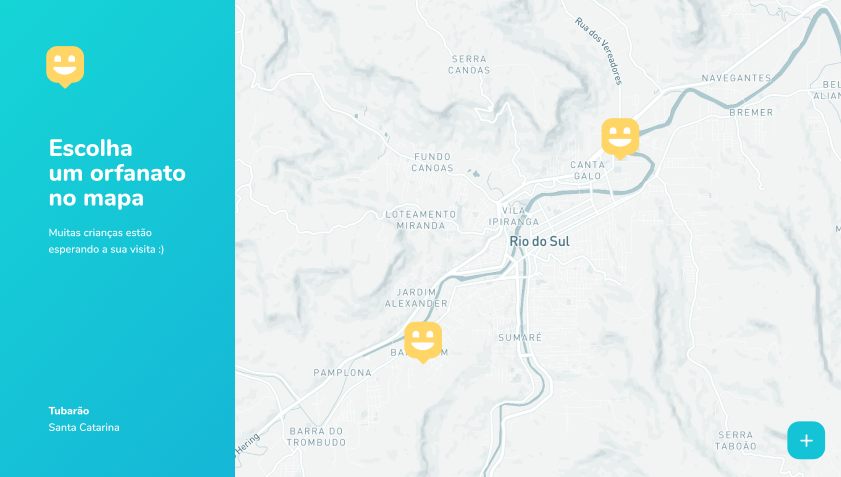
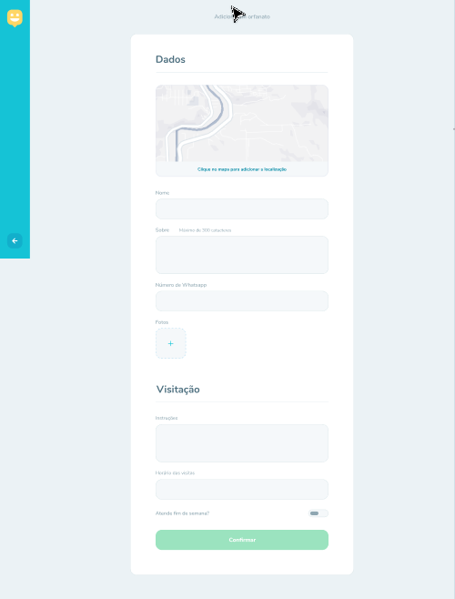
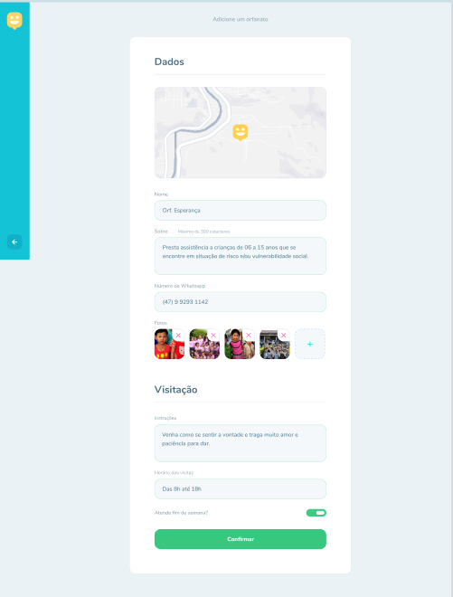
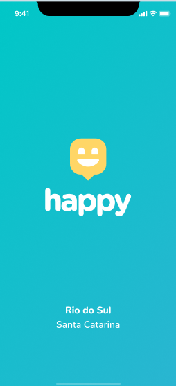
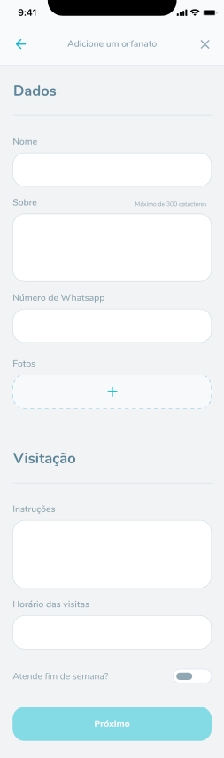
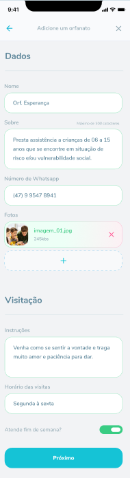

<h1 align="center">
    
</h1>

<h4 align="center"> 
	NextLevelWeek 1.0 🚀
</h4>

## 💻 Sobre o projeto

:rocket: Happy - É uma forma de encontrar instutuições de orfanato.


### Web

<p align="center" style="display: flex; align-items: flex-start; justify-content: center;">
  

  
  
  
  
  
  
</p>

### Mobile

<p align="center">
  

  
  
  
  
  
  
</p>


## 🛠 Tecnologias

As seguintes ferramentas foram usadas na construção do projeto:

- [Expo][expo]
- [Node.js][nodejs]
- [React][reactjs]
- [React Native][rn]
- [TypeScript][typescript]


## 🚀 Como rodar este projeto

Podemos considerar este projeto como sendo divido em três partes:
1. Back End (pasta backend) 
2. Front End (pasta web)
3. Mobile (pasta mobile)

💡Tanto o Front End quanto o Mobile precisam que o Back End esteja sendo executado para funcionar.

### Pré-requisitos

Antes de começar, você vai precisar ter instalado em sua máquina as seguintes ferramentas:
[Git](https://git-scm.com), [Node.js][nodejs]. 
Além disto é bom ter um editor para trabalhar com o código como [VSCode][vscode]

### 🎲 Rodando o Back End (servidor)

```bash
# Clone este repositório
$ git clone 

# Acesse a pasta do projeto no terminal/cmd
$ cd Happy

# Vá para a pasta server
$ cd backend

# Instale as dependências
$ npm install 

# Execute a aplicação em modo de desenvolvimento
$ npm run dev:server

# O servidor inciará na porta:3333 - acesse http://localhost:3333 
```

### 🧭 Rodando a aplicação web (Front End)

```bash
# Clone este repositório
$ git clone 

# Acesse a pasta do projeto no seu terminal/cmd
$ cd Happy

# Vá para a pasta da aplicação Front End
$ cd web

# Instale as dependências
$ npm install

# Execute a aplicação em modo de desenvolvimento
$ npm start

# A aplicação será aberta na porta:3000 - acesse http://localhost:3000
```

## OBS:

Para rodar o mapa será necessário criar um arquivo .env e nele usar a variavel REACT_APP_MAPBOX_TOKEN e aribuir nela o valor do token, que é
adquirido na sessão de conta do mapbox

### 📱Rodando a aplicação mobile 

```bash
# Clone este repositório
$ git clone 

# Acesse a pasta do projeto no seu terminal/cmd
$ cd Happy

# Vá para a pasta da aplicação Mobile
$ cd mobile

# Instale as dependências
$ npm install

# Execute a aplicação em modo de desenvolvimento
$ npm start
```
